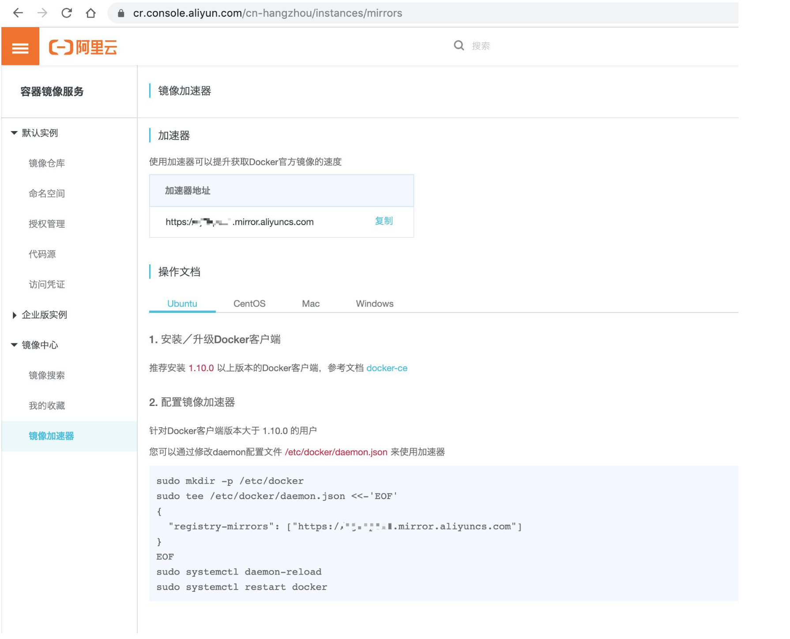

# Docker

## 什么是 Docker？

Docker 是免费的虚拟机引擎，可以为任何应用创建一个轻量级的、可移植的容器。

### Docker 镜像

1. Docker 虚拟机镜像是一个只读层，不能写入数据。
2. 我们可以通过 dockerfile 文件，定义需要安装的程序，然后创建出镜像文件。

### Docker 容器

1. Docker 容器是一个虚拟的实例，里面的内容可读可写。
2. 容器是完全隔离的，我们不用担心部署程序会相互干扰。
3. 一个镜像可以创建出多个容器。

## 为什么使用 Docker？

VM 虚拟机创建的是完整的虚拟系统，所以对占用硬件较高，属于重量级虚拟机。

Docker 虚拟机创建的虚拟实例共用同一个系统内核，对硬件占用较小，属于轻量级虚拟机。

## 安装部署

1. 在 CentOS 上安装 Docker 虚拟机

   ```bash
   yum install -y docker
   systemctl start docker
   systemctl stop docker
   ```

## 基础命令

### 镜像与容器

1. run 从镜像创建并运行一个容器
2. exec 在容器中执行命令
3. start/stop 启动和停止容器
4. pause/unpause 暂停和恢复容器
5. ps 列出容器
6. rm/rmi 删除容器/删除镜像
7. commit 将容器打包为镜像

### 镜像与仓库

1. search 从 DockerHub 中查询镜像
2. push 推送镜像到仓库
3. pull 从仓库拉取镜像到本地

### 镜像与文件

1. save 导出镜像为 tar 文件

   ```bash
   docker save -o ./openjdk.ta.gz docker.io/openjdk
   ```

2. load 从 tar 文件导入镜像

   ```bash
   docker load < ./openjdk.tar.gz
   ```

3. build 从 Dockerfile 文件构建镜像

## DockerCompose

### 什么是 DockerCompose？

### 为什么使用 DockerCompose？

### 安装部署

1. 下载 docker-compose

   ```bash
   curl -L https://get.daocloud.io/docker/compose/releases/download/1.26.2/docker-compose-`uname -s`-`uname -m` > /usr/local/bin/docker-compose
   ```

2. 给予执行权限

   ```bash
   chmod +x /usr/local/bin/docker-compose
   ```

3. 测试安装是否成功

   ```bash
   docker-compose --version
   ```

> 参考文档：http://get.daocloud.io/#install-compose

### docker-compose.yml

docker-compose.yml 用于配置 docker-compose 要管理的容器信息。

以安装 mongodb 为例：

```yaml
version: '3.1'
services:
	mongo:
		image: mongo
    	restart: always
    	environment:
			MONGO_INITDB_ROOT_USERNAME: root
        	MONGO_INITDB_ROOT_PASSWORD: password
    	ports:
			- 27017:2701
		volumes:
			- /data/mongodb/db:/data/db
```

### 基础命令

1. up 创建和启动容器

   ```bash
   docker-compose up -d
   ```

   [options]:

   - -d: 后台运行容器

## 镜像加速

### 阿里云镜像加速器

1. 获取加速器

   

2. 修改配置文件

   ```bash
   vim /etc/docker/daemon.json
   {"registry-mirrors": ["https://xxxxxx.mirror.aliyuncs.com"]}
   ```

3. 重启 docker

   ```bash
   systemctl restart docker
   ```
