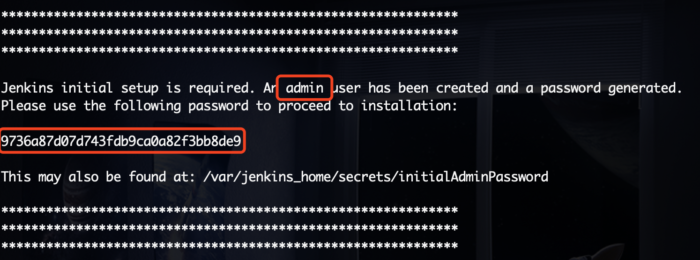
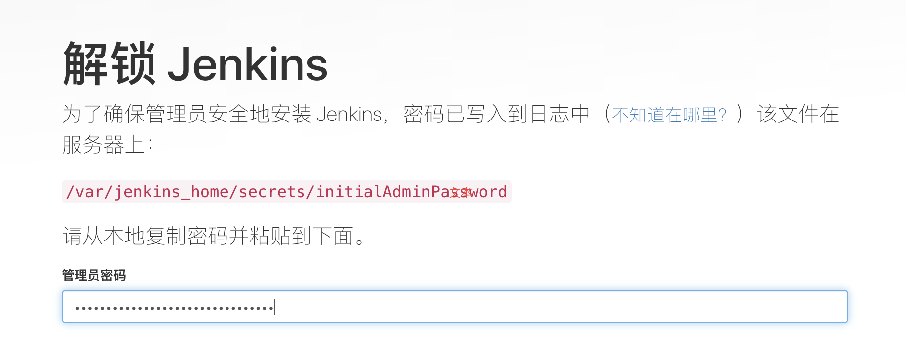

# Jenkins

## 什么是Jenkins

##  为什么使用Jenkins

## 安装部署

### docker部署

1. 下载镜像，启动容器

   ```bash
   docker run -itd --name jenkins -p 11005:8080 -p 50000:50000 jenkins/jenkins:lts
   ```

2. 获取默认密码

   ```bash
   docker logs -f jenkins
   ```

   

3. 解锁Jenkins

   访问`http://localhost:11005`，填入密码解锁Jenkins

   

